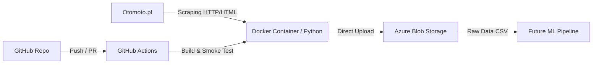

# 🚗 Otomoto Data Ingestion Pipeline

[](https://github.com/Bilicki-Org/otomoto-scraper/actions)
[](https://python.org)
[](https://www.docker.com/)
[](https://azure.microsoft.com/en-us/services/storage/blobs/)

## 📋 Project Overview

This repository contains a robust **ETL (Extract, Transform, Load) pipeline** designed to harvest automotive data from Otomoto.pl. The system scrapes vehicle listings, processes them, and securely uploads raw datasets directly to **Azure Blob Storage**.

The goal is to build a comprehensive, historical dataset for training Machine Learning models (specifically for Price Prediction). Unlike simple scrapers, this project follows **MLOps best practices**: containerization, cloud integration, and automated CI testing.

---

### 🏗 Architecture



**Key Features:**
* **Containerized Environment:** Fully dockerized application ensures reproducibility across different environments (Dev/Prod).
* **Direct Cloud Integration:** Scraped data is automatically streamed to **Azure Blob Storage**, eliminating local storage dependencies.
* **CI/CD Pipeline:** Automated GitHub Actions workflow builds the Docker image and performs smoke tests on every push to the `main` branch.
* **Clean Code Standards:** Modular structure (`src/` layout), Type Hinting, and dependency management via `requirements.txt`.

---

## 🛠 Tech Stack

* **Language:** Python 3.11
* **Core Libraries:** `requests`, `beautifulsoup4`, `pandas`
* **Cloud SDK:** `azure-storage-blob`
* **Infrastructure:** Docker
* **CI/CD:** GitHub Actions

---

## 🚀 Getting Started

Follow these instructions to run the pipeline locally or in a container.

### Prerequisites

* Docker Desktop installed
* Git installed
* Azure Storage Account (Connection String)

### 1. Clone the repository

```bash
git clone [https://github.com/Bilicki-Org/otomoto-scraper.git](https://github.com/Bilicki-Org/otomoto-scraper.git)
cd otomoto-scraper
```

### 2. Configuration (.env)

Security first. The application requires environment variables to access Azure resources.
Create a `.env` file in the root directory based on the example:

```bash
# Copy the example file
cp .env.example .env
```

Open `.env` and fill in your Azure credentials:
```ini
AZURE_STORAGE_CONNECTION_STRING="your_actual_azure_connection_string_here"
```

> **Note:** The `.env` file is git-ignored to prevent leaking credentials.

### 3. Run with Docker (Recommended)

Running in Docker guarantees that the environment matches the production setup.

**Build the image:**
```bash
docker build -t otomoto-scraper:latest .
```

**Run the scraper:**
(We pass the `.env` file to the container so it can authenticate with Azure)
```bash
docker run --rm --env-file .env otomoto-scraper:latest
```

---

## 💻 Local Development (Without Docker)

If you want to contribute, debug, or run the code without Docker:

1.  **Create virtual environment:**
    ```bash
    python -m venv .venv
    # Windows:
    .venv\Scripts\activate
    # Linux/Mac:
    source .venv/bin/activate
    ```

2.  **Install dependencies:**
    ```bash
    pip install -r requirements.txt
    ```

3.  **Run the script:**
    ```bash
    python src/main.py
    ```

---

## 📂 Project Structure

```text
otomoto-scraper/
├── .github/workflows/   # CI/CD Pipeline definitions
├── src/                 # Source code
│   ├── main.py          # Entry point & Logic
│   └── ...              # Helper modules
├── .dockerignore        # Optimizes Docker build context
├── .env.example         # Template for environment variables
├── .gitignore           # Git ignore rules
├── Dockerfile           # Docker image definition
├── README.md            # Project documentation
└── requirements.txt     # Python dependencies (pinned versions)
```

## 📊 Data Preview

The pipeline extracts over 30 features for each vehicle. Below is a simplified preview of key columns from the dataset:

| brand      | model             | year | price     | currency | mileage_km | fuel_type | power_hp | location_city |
|------------|-------------------|------|-----------|----------|------------|-----------|----------|---------------|
| Renault    | Koleos            | 2015 | 32 500.0  | PLN      | 199 000    | Diesel    | 150.0    | Ostrowiec Św. |
| Toyota     | Auris             | 2014 | 42 900.0  | PLN      | 148 000    | Hybryda   | 99.0     | Warszawa      |
| Audi       | A3                | 2008 | 15 900.0  | PLN      | 182 000    | Benzyna   | 102.0    | Brzeg Dolny   |
| Land Rover | Range Rover Evoque| 2021 | 124 900.0 | PLN      | 75 000     | Benzyna   | 249.0    | Staszów       |
| Ford       | Mondeo            | 2015 | 29 999.0  | PLN      | 245 084    | Diesel    | 150.0    | Szczecin      |

> **Note:** The full dataset includes comprehensive technical details like `engine_capacity_cm3`, `drive`, `body_type`, `gearbox`, and original listing URLs.
